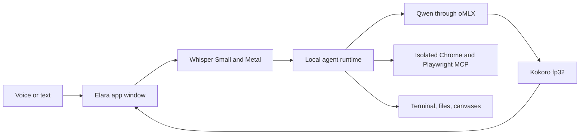

# Elara

Elara is a fully local voice and text assistant for Apple silicon Macs. It combines a fast MLX language model served by [oMLX](https://github.com/jundot/omlx), local Whisper speech recognition, full precision Kokoro speech synthesis, an agent controlled Chrome browser, terminal tools, and canvases in one minimizable app window.

The default configuration uses `Qwen3.6-35B-A3B-4bit`. Its mixture of experts design keeps generation responsive while retaining stronger tool use than the smaller models tested for this setup. You can point the installer at another MLX model you already have.

## What you get

- Fully local chat, speech recognition, and spoken replies
- High quality Kokoro `af_heart` speech at 24 kHz, generated in full precision on the CPU
- Whisper Small with Metal acceleration and automatic language detection
- One terminal command: `elara`
- A normal macOS window that can be minimized
- A text box and hands free microphone mode in the same conversation
- A local Chrome browser the agent can inspect and operate
- An authenticated embedded browser view that does not depend on port 3011
- Local terminal, file, and canvas tools

## Install

Elara supports Apple silicon and macOS 15 or newer. Before installing, have these ready:

1. Google Chrome.
2. [oMLX](https://github.com/jundot/omlx), opened once so `~/.omlx/settings.json` exists.
3. An MLX model directory. The default installer looks for `Qwen3.6-35B-A3B-4bit` in oMLX or LM Studio.
4. Xcode Command Line Tools and CMake.

```sh
xcode-select --install
brew install cmake
git clone --branch elara-mac https://github.com/MorarFS/elara-local-voice-assistant.git
cd elara-local-voice-assistant
./install-mac.sh
```

The installer uses `~/Library/Application Support/Elara`, installs an isolated Node.js runtime, builds Whisper with Metal support, downloads the Whisper and Kokoro models, builds the web app, and creates a private local password. It does not copy model weights or credentials into the repository.

To use a different model:

```sh
ELARA_MODEL='Your-MLX-Model' \
ELARA_MODEL_PATH='/absolute/path/to/Your-MLX-Model' \
./install-mac.sh
```

The selected model needs an OpenAI compatible chat template and reliable tool calling. A vision capable model is recommended because Elara can send browser screenshots to the model.

See [INSTALL.md](INSTALL.md) for the full install, run, update, and troubleshooting guide.

## Run

```sh
elara
```

The command starts the local model, speech services, browser, and portal, copies the private login password to the clipboard, and opens the saved Elara chat in a dedicated Chrome app window.

Other commands:

```sh
elara start    # start without opening the window
elara stop     # stop Elara and close its app window
elara restart  # stop old instances, then open one clean instance
elara status   # show local service health
elara help
```

Type in the composer for text chat. Click the microphone for hands free conversation. The first microphone use may trigger a macOS permission prompt for Google Chrome.

## Local architecture



Every service binds to loopback. Elara can browse the internet when you ask it to use the browser, but prompts, transcripts, model inference, and speech synthesis stay on the Mac.

## Project lineage

Elara is built as a macOS focused fork of [thecodacus/pithagoras](https://github.com/thecodacus/pithagoras), following the local voice agent architecture demonstrated by Codacus. The upstream repository did not include a source license when this fork was prepared. Check the upstream project before redistributing derived source.
